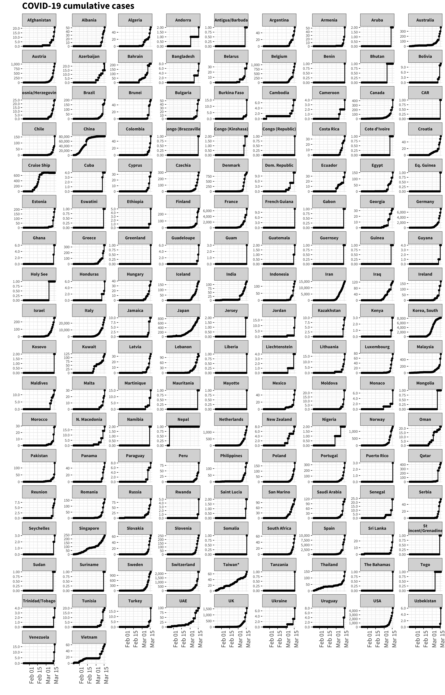
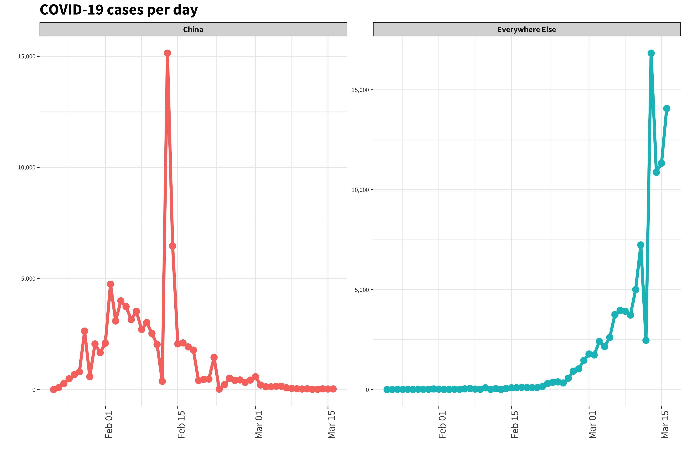
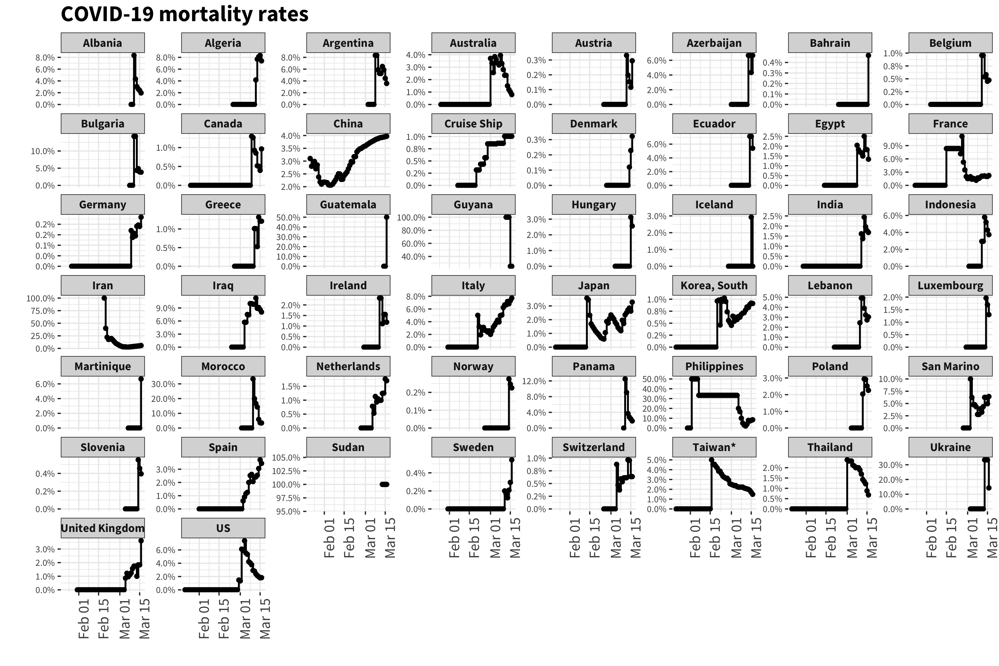

# covid19-vis
Some quick plots of data from the COVID-19 outbreak, data sourced from [here](https://github.com/CSSEGISandData/COVID-19).

## Cases by country

* The cumulative confirmed cases in China, compared to the rest of the world.

* The cumulative confirmed cases in each affected country.

## Rate of New Cases

* The number of new confirmed cases per day in China, compared to the rest of the world.

* The number of new confirmed cases per day (top six countries only)

## Mortality and Recovery

* Global mortality rate (left) and both global mortality and recovery rates (right).

* Mortality rates for each affected country.

* Recovery rates for each affected country.

