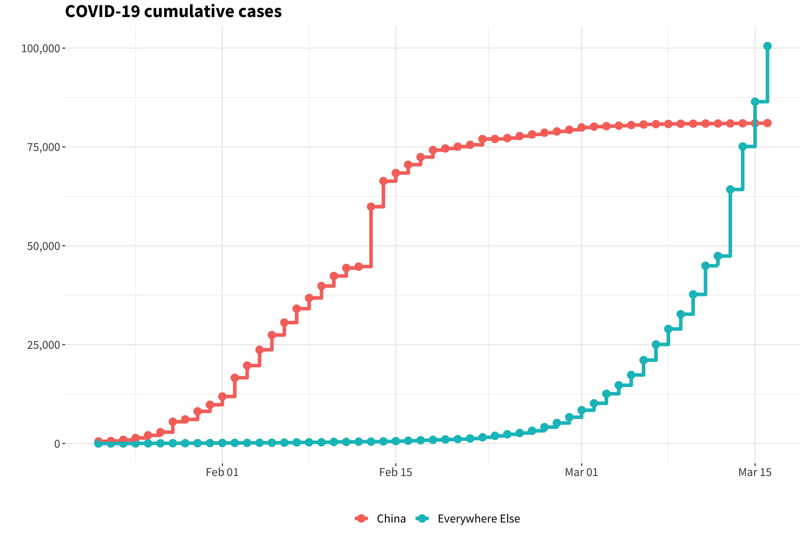
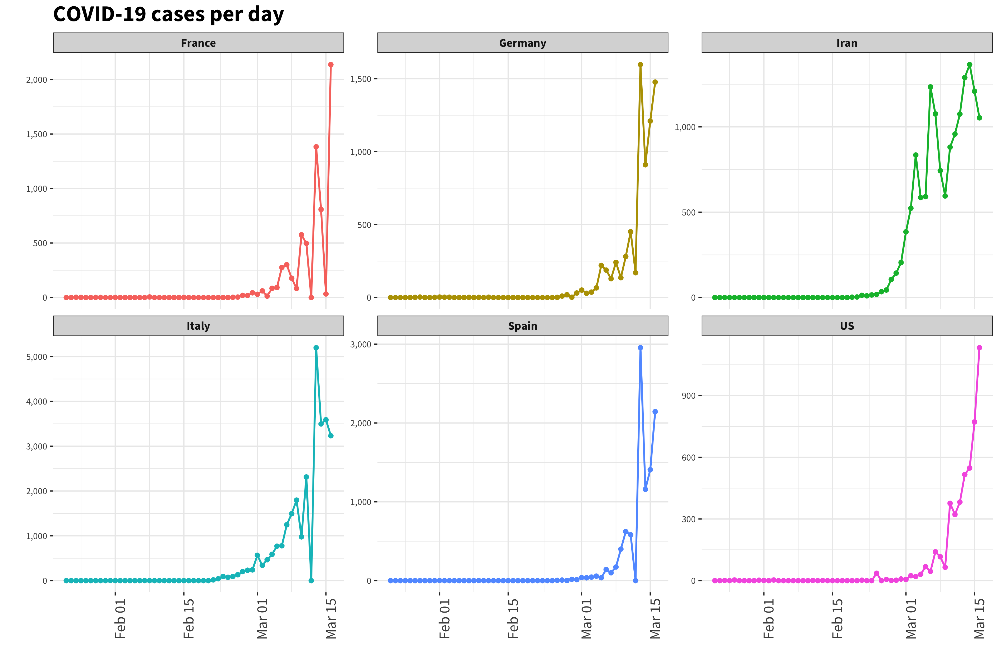
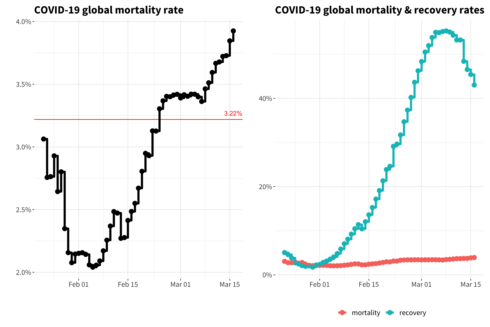
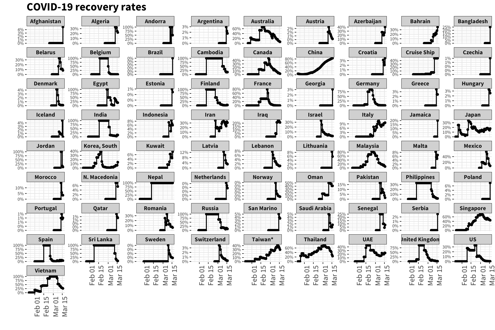
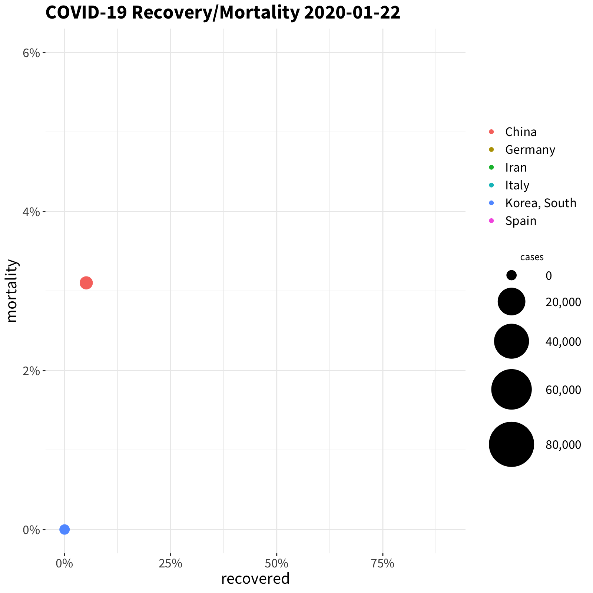
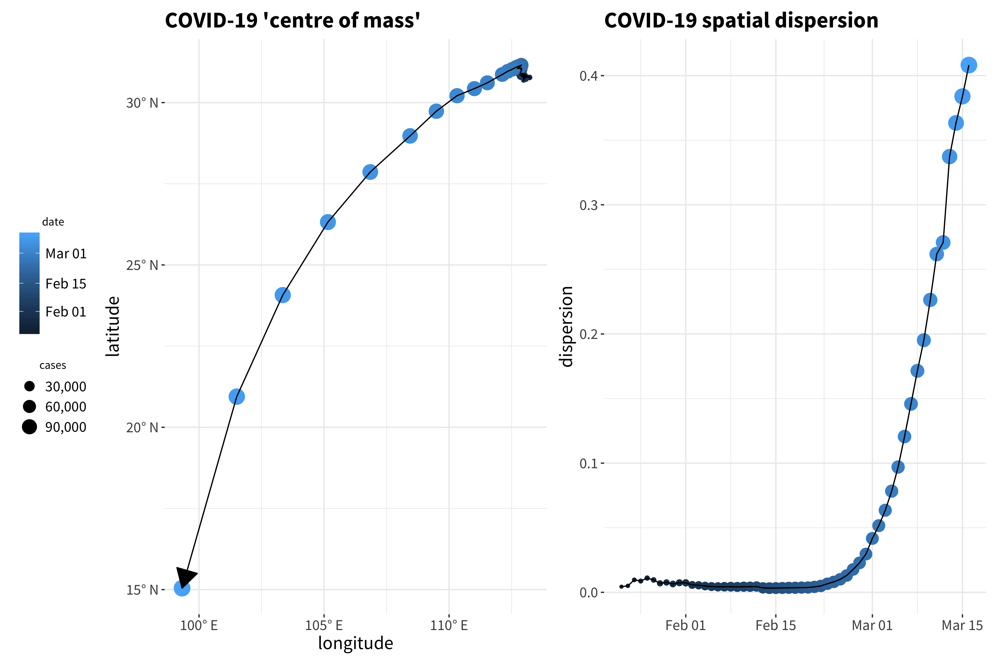
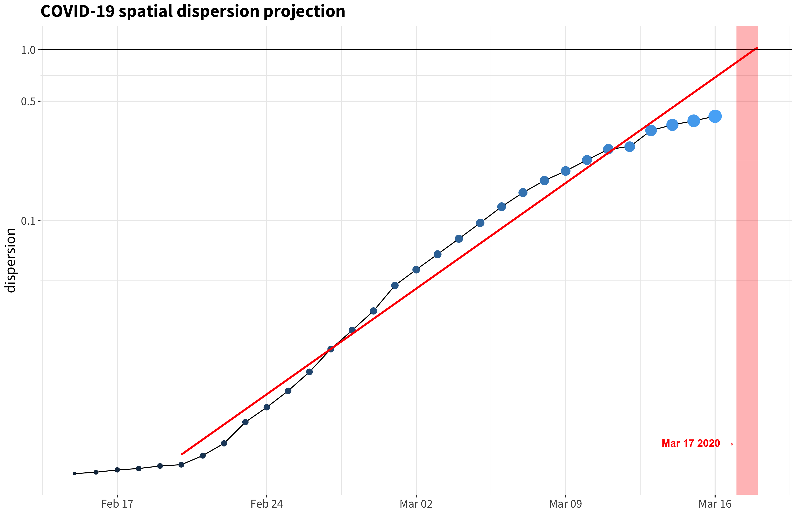
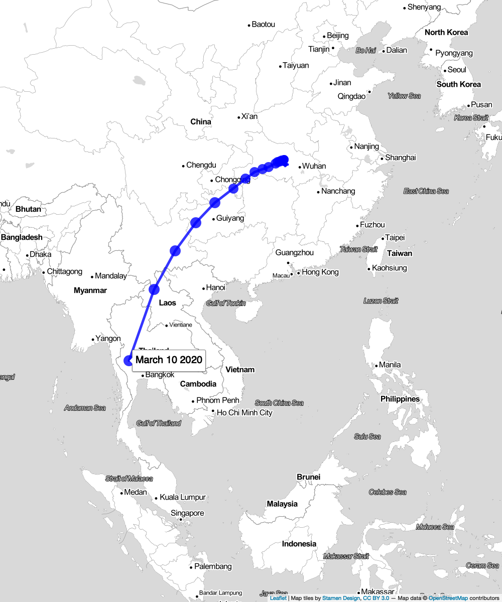
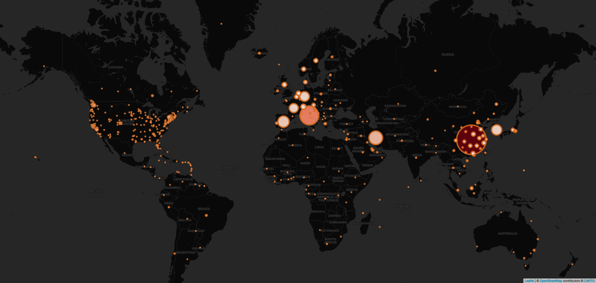
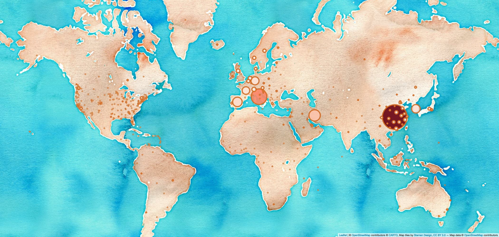

# covid19-vis
Some quick plots of data from the COVID-19 outbreak, data sourced from [here](https://github.com/CSSEGISandData/COVID-19). 

Latest data is from **13th March 2020**.

## Caveats

* #not_an_epidemiologist
* all data is provisional and subject to change
* standards and definitions of e.g. "recovery" may differ in different countries
* at this point, the time to recovery (or death) is comparable to the total observation time, so all data is subject to e.g. phase lag effects -- e.g. mortality rate will go down if an area has a sudden glut of confirmed cases, simply because those new cases are ongoing and have unknown recovery/mortality status
* no error bars or confidence intervals are included for exactly this reason

## Cases by country

* The cumulative confirmed cases in China, compared to the rest of the world.

* The cumulative confirmed cases in each affected country (note: *y* axes are independent)

## Rate of New Cases

* The number of confirmed cases per day in China, compared to the rest of the world (note: *y* axes are independent)

* The number of new confirmed cases per day (note: top six countries only, *y* axes are independent)

## Mortality and Recovery

* Global mortality rate against time (left) and both global mortality and recovery rates against time (right). Where "mortality" and "recovery" rates are defined as (total deaths / total cases) and (total recoveries / total cases) at each date point respectively.

* Mortality rates for each affected country (note: *y* axes are independent)

* Recovery rates for each affected country (note: *y* axes are independent)

* Mortality and recovery animated over time (top six countries only). Each dot represents a country, with the dot size proportional to the number of cases. The main dot (China) moves to the right over time, indicating more recovered cases, while the other countries are yet to settle into a stable pattern. Note that even China, on the most recent day available, still has only ~70% recovered and ~3% mortality, indicating ~25% of known cases are ongoing.

## Spatial Evolution

* On the left is the spherical weighted average of latitude and longitude (where smallest area is recorded as e.g. Chinese province) of confirmed cases. As the majority of cases are still in Hubei, China, the "centre of mass" of the outbreak is still in China, currently moving west at about ~6° a week and south at roughly half that pace.
* By transforming the latitudes and longitudes into spherical co-ordinates before averaging, we can obtain the average distance from the centre of the Earth, and use this as a first order proxy for weighted disease spread, i.e. here a value of 0 would indicate all the cases are in exactly the same place, and a value of 1 indicates equal spread over a full hemisphere.

* Looking at the right hand plot above, and plotting the *y* axis as a logarithm, we can see that (arguably) exponential behaviour starts from February 20th. An exponential fit to the data is shown below -- if this behaviour continues, the weighted "dispersion" will be approximately global on the date the dispersion equals one.

## Maps

* A look at the moving "centre of mass" from above, on a geographical map.

* Now, some straightforward maps showing number of cases with the most recent data.

